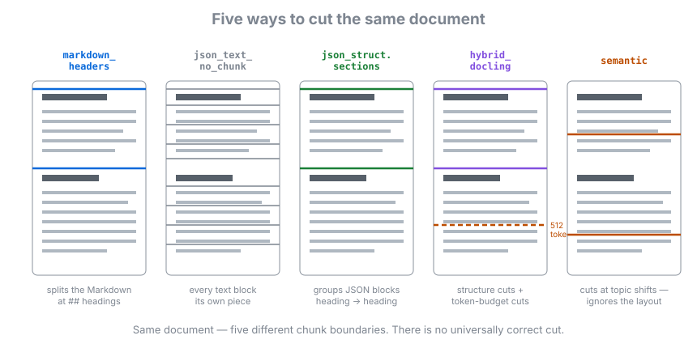

<div style="background-color: #ffffff; color: #000000; padding: 10px;">

<h1> RAG workshop materials
</div>

Teaching material of the HPI AI Service Centre for a workshop series on retrieval-augmented generation. Nine marimo notebooks take you from cutting a corpus into chunks through to measuring whether the answers a RAG system gives are faithful to what it retrieved. Everything is hands-on: you change a setting, you see the score move.



## Features

- **Chunking you can feel**: an opening exercise where you tune a configuration against 164 real questions and a pre-measured score table, with no key and no network needed.
- **Retrieval metrics from scratch**: Recall@k, MRR and nDCG built up on a real corpus rather than defined on a slide.
- **Text, image and multimodal embeddings**: image-to-image, text-to-image and image-to-text retrieval over 26 bird species.
- **Real documents**: the BSI IT-Grundschutz-Kompendium through Docling, with structure-aware chunking into Qdrant.
- **OCR compared honestly**: classical OCR against a vision-language model on pages that break a text layer.
- **Evaluation with RAGAS**: context precision and recall, answer correctness and faithfulness, each with an experiment attached.
- **Anonymous scoring**: participants submit a score under a random handle, and the room sees its own before-and-after.

## Setup and Installation

### Prerequisites

[`aihpi/workshop-getting-started`](https://github.com/aihpi/workshop-getting-started) installs `uv`, Docker and `git`, and is the preparation for this repository. Work through it first.

On top of that you need an API key for the AISC inference API, which is handed out at the workshop, and a GitHub account if you want to submit a score.

### Quick Start

```bash
git clone https://github.com/aihpi/workshop-rag.git
```

```bash
cd workshop-rag/notebooks
```

```bash
uv sync
```

```bash
uv run marimo run w2_00_chunking_playground.py
```

That first notebook needs no key, no Docker and no network. The key and Qdrant come in at `w2_02`, and [notebooks/README.md](notebooks/README.md) is the step-by-step guide that takes you the rest of the way.

## User Guide

### Using the notebooks

Run each one from `notebooks/`, in order. `marimo run` gives the app view with the code hidden; `marimo edit` opens every cell for editing.

| Notebook | Topic |
|---|---|
| `w2_00_chunking_playground` | Tune a chunking and embedding configuration against a measured score table, twice: once knowing nothing, once at the end |
| `w2_01_chunking_and_retrieval` | Preprocessing, chunking strategies, text embeddings, retrieval metrics, choosing a model |
| `w2_02_embedding_models` | Image and text embeddings, and the shared multimodal space |
| `w2_03_real_world_datentypen` | A real PDF through Docling: structure-aware chunking, Qdrant, RAG answers |
| `w2_04_ocr_docling_vlm_comparison` | Docling OCR against Docling's vision model against an external one |
| `w3_01_intro_end_to_end` | A whole pipeline end to end, and what RAGAS measures |
| `w3_02_ingestion` | PDF to Docling to chunks to embeddings to Qdrant |
| `w3_03_retrieval_evaluation` | Context precision and recall, and the top-k experiment |
| `w3_04_generation_evaluation` | Answer correctness and faithfulness, and the prompt experiment |

### Recommendations

Run `w3_02` before `w3_03` and `w3_04`: it fills the collection they query. Start `w2_00` before anyone's setup is finished, since it needs nothing, and run it again at the end so the room can see how much it learned. The slide decks in [`slides/`](slides/) accompany the notebooks in German and English.

## Limitations

- **The inference API is a dependency**: everything from `w2_02` onwards needs an AISC key. There is no local-model fallback.
- **The playground only offers what was measured**: its controls are chained to the configurations in `data/grid/`, so widening the choice means re-running the grid, which costs hours.
- **The corpus is German and specific**: results on the IT-Grundschutz-Kompendium do not automatically carry over to another domain.
- **Image embeddings are partly switched off**: the two cross-modal directions turn on once the API embeds pictures as pictures rather than tokenising the data URI.

## References

- [AI Service Centre Berlin-Brandenburg](https://hpi.de/kisz)
- [marimo](https://marimo.io), the reactive notebook the material is built on
- [Docling](https://github.com/docling-project/docling), for document conversion
- [RAGAS](https://docs.ragas.io), for the evaluation metrics
- [Qdrant](https://qdrant.tech), the vector database

## Data and licences

- BSI IT-Grundschutz-Kompendium 2023 and BSI Standard 200-1 (Bundesamt für Sicherheit in der Informationstechnik), with question sets from the GSKI pilot project, under `notebooks/data/` and `notebooks/raw_data/`.
- Bird photographs from Wikimedia Commons under CC0, CC BY and CC BY-SA licences, and German Wikipedia extracts (CC BY-SA 4.0), under `notebooks/raw_data/birds/` with an attribution list per file.
- Two papers for the OCR notebook under `notebooks/raw_data/`.

## About the repository name

The working copy was created as `workshop-ragV2` while the earlier `workshop-rag` (now archived as `workshop-rag-legacy`) was still in use. It is a single workshop series, not a second part.

## Author

- [AI Service Centre Berlin-Brandenburg](https://hpi.de/kisz), Hasso Plattner Institute

## Issues

Issues and feature requests go to the [issue tracker](https://github.com/aihpi/workshop-rag/issues).

## License

See [LICENSE](LICENSE).

---

## Acknowledgements


The [AI Service Centre Berlin Brandenburg](http://hpi.de/kisz) is funded by the [Federal Ministry of Research, Technology and Space](https://www.bmbf.de/) under the funding code 16IS22092.
